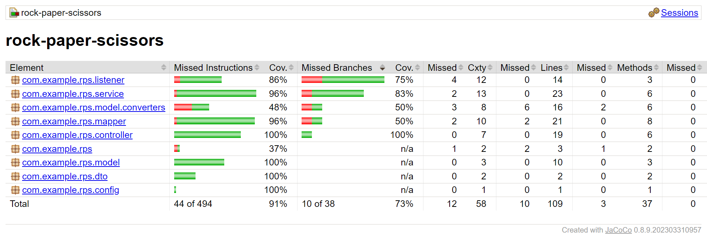

# Rock Paper Scissors

## Advantages:

- `Modularity:` By using Spring Boot and Spring MVC, we can separate different parts of the game easily. This helps us
  organize the code better and maintain it easily.

- `Scalability:` Although the game now only supports two players, I've set it up to add more players in the future by
  implementing a proper player management system.

- `Persistence and Statistics:` The game stores the history and player statistics, so users can check their past results
  and track progress over time.

- `User-Friendly UI:` The simple design using HTML + Thymeleaf provides an easy-to-understand interface, making it
  straightforward for players to interact with the game.

## Disadvantages:

- `Limited Players:` Currently, the game is only designed for one pair of two players.

- `Lack of Thread Safety:` When multiple players access the game simultaneously, there may be issues like race
  conditions.

### Demo

### Code Coverage: 91%

